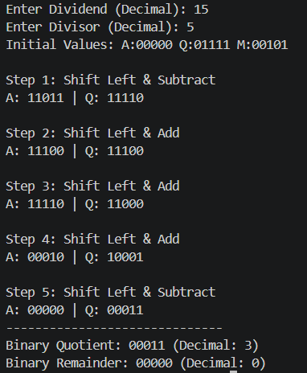

# Lab 10: Non-Restoring Division Algorithm

---

## Objective

- To understand the Non-Restoring Division algorithm for unsigned binary numbers.
- To implement the Non-Restoring Division algorithm and verify it with test cases.

---

## Theory

The Non-Restoring Division algorithm is an efficient binary division method that avoids the costly restoration step found in the Restoring Division algorithm. Instead of restoring the partial remainder when it becomes negative, the algorithm compensates in the next step by adding instead of subtracting.

The key advantage over restoring division is that only one arithmetic operation (add or subtract) is performed per step, reducing hardware complexity.

---

## Algorithm

Given dividend Q and divisor M, both n bits, with Accumulator A = 0:

1. **Initialize:** A = 0, load dividend into Q, count = n.
2. **Shift Left** the combined register [A, Q] by 1 bit.
3. **Check previous step result (flag):**

| Previous A | Operation     | Result Q bit |
|------------|---------------|--------------|
| Positive   | A = A − M     | Q₀ = 1 if A ≥ 0, else Q₀ = 0 |
| Negative   | A = A + M     | Q₀ = 1 if A ≥ 0, else Q₀ = 0 |

4. **Repeat** steps 2–3 for n cycles.
5. **Correction:** If final A is negative, perform A = A + M.
6. **Result:** Quotient in Q, Remainder in A.

---

## Program

```python
def add(A, M):
    carry = 0
    Sum = ""
    for i in range(len(A) - 1, -1, -1):
        temp = int(A[i]) + int(M[i]) + carry
        Sum += str(temp % 2)
        carry = 1 if temp > 1 else 0
    return Sum[::-1]


def compliment(m):
    M = ''.join('1' if b == '0' else '0' for b in m)
    one = '0' * (len(m) - 1) + '1'
    return add(M, one)


def nonRestoringDivision(dividend_dec, divisor_dec):
    bit_len = max(dividend_dec.bit_length(), divisor_dec.bit_length()) + 1
    Q = format(dividend_dec, f'0{bit_len}b')
    M = format(divisor_dec, f'0{bit_len}b')
    A = '0' * bit_len
    comp_M = compliment(M)
    flag = 'successful'

    print(f"Initial Values: A:{A} Q:{Q} M:{M}")

    for i in range(1, bit_len + 1):
        print(f"\nStep {i}: ", end="")
        combined = A + Q
        combined = combined[1:]
        A = combined[:bit_len]
        Q_temp = combined[bit_len:]

        if flag == 'successful':
            A = add(A, comp_M)
            print("Shift Left & Subtract")
        else:
            A = add(A, M)
            print("Shift Left & Add")

        if A[0] == '1':
            Q = Q_temp + '0'
            flag = 'unsuccessful'
        else:
            Q = Q_temp + '1'
            flag = 'successful'

        print(f"A: {A} | Q: {Q}")

    if A[0] == '1':
        print("\nFinal Step: A is negative, performing correction (A = A + M)")
        A = add(A, M)

    print("-" * 30)
    print(f"Binary Quotient: {Q} (Decimal: {int(Q, 2)})")
    print(f"Binary Remainder: {A} (Decimal: {int(A, 2)})")


if __name__ == "__main__":
    try:
        num1 = int(input("Enter Dividend (Decimal): "))
        num2 = int(input("Enter Divisor (Decimal): "))
        if num2 == 0:
            print("Division by zero is not allowed.")
        else:
            nonRestoringDivision(num1, num2)
    except ValueError:
        print("Please enter valid integers.")
```

---

## Output

**Test Case: Dividend = 15, Divisor = 5**

```
Enter Dividend (Decimal): 15
Enter Divisor (Decimal): 5
Initial Values: A:00000 Q:01111 M:00101

Step 1: Shift Left & Subtract
A: 11011 | Q: 11110

Step 2: Shift Left & Add
A: 11100 | Q: 11100

Step 3: Shift Left & Add
A: 11110 | Q: 11000

Step 4: Shift Left & Add
A: 00010 | Q: 10001

Step 5: Shift Left & Subtract
A: 00000 | Q: 00011
------------------------------
Binary Quotient: 00011 (Decimal: 3)
Binary Remainder: 00000 (Decimal: 0)
```

**Verification:** 15 ÷ 5 = **3** remainder **0** ✓



---

## Conclusion

The Non-Restoring Division algorithm was successfully implemented in Python and verified for unsigned binary division. The test case of 15 ÷ 5 produced the correct quotient of 3 and remainder of 0, confirming that the algorithm accurately performs binary division by conditionally adding or subtracting the divisor at each step without restoring the partial remainder.
