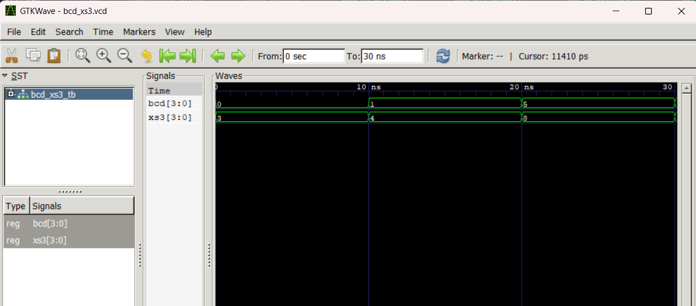
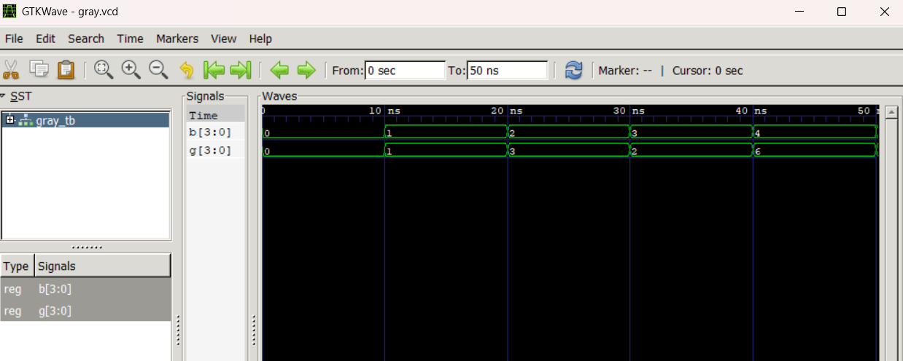

# Lab 6: VHDL Code for Code Converters (BCD-to-Excess3 and Binary-to-Gray)

---

## Objective

- To design and simulate a **BCD-to-Excess3 (XS-3) Code Converter** in VHDL.
- To design and simulate a **4-bit Binary-to-Gray Code Converter** in VHDL.

---

## Theory

### BCD-to-Excess3 Converter

Excess-3 (XS-3) is a non-weighted BCD code derived by adding 3 (0011) to each BCD digit. It is self-complementing and was historically used in early decimal computers.

| BCD (Decimal) | BCD Code | XS-3 Code |
| ------------- | -------- | --------- |
| 0             | 0000     | 0011      |
| 1             | 0001     | 0100      |
| 5             | 0101     | 1000      |
| 9             | 1001     | 1100      |

### Binary-to-Gray Converter

Gray code is a binary numeral system where two successive values differ in only one bit. A 4-bit binary number is converted to Gray code using the relation:

- G(3) = B(3)
- G(2) = B(3) XOR B(2)
- G(1) = B(2) XOR B(1)
- G(0) = B(1) XOR B(0)

| Binary (B) | Gray (G) |
| ---------- | -------- |
| 0000       | 0000     |
| 0001       | 0001     |
| 0010       | 0011     |
| 0011       | 0010     |
| 0100       | 0110     |
| 1111       | 1000     |

---

## Files Included

| File              | Description                                            |
| ----------------- | ------------------------------------------------------ |
| `bcd_to_xs3.vhd`  | VHDL implementation of the BCD-to-Excess3 Converter    |
| `bcd_xs3_tb.vhd`  | Testbench for the BCD-to-Excess3 Converter             |
| `bin_to_gray.vhd` | VHDL implementation of the Binary-to-Gray Converter    |
| `gray_tb.vhd`     | Testbench for the Binary-to-Gray Converter             |
| `bcd_xs3.vcd`     | Value Change Dump output for BCD-to-XS3 simulation     |
| `gray.vcd`        | Value Change Dump output for Binary-to-Gray simulation |
| `work-obj93.cf`   | GHDL work library configuration file                   |

---

## Simulation

Simulation was performed using **GHDL** and waveforms were viewed in **GTKWave**.

### Commands Used

**BCD-to-Excess3:**

```bash
ghdl -a bcd_to_xs3.vhd bcd_xs3_tb.vhd
ghdl -e BCD_XS3_TB
ghdl -r BCD_XS3_TB --vcd=bcd_xs3.vcd
gtkwave bcd_xs3.vcd
```

**Binary-to-Gray:**

```bash
ghdl -a bin_to_gray.vhd gray_tb.vhd
ghdl -e GRAY_TB
ghdl -r GRAY_TB --vcd=gray.vcd
gtkwave gray.vcd
```

---

## Simulation Results

### BCD-to-Excess3 Waveform

The testbench drives four BCD values, each lasting 10 ns, and observes the corresponding XS-3 output.

| Time     | BCD[3:0] | XS3[3:0]  |
| -------- | -------- | --------- |
| 0–10 ns  | 0000 (0) | 0011 (3)  |
| 10–20 ns | 0001 (1) | 0100 (4)  |
| 20–30 ns | 0101 (5) | 1000 (8)  |
| 30–40 ns | 1001 (9) | 1100 (12) |



---

### Binary-to-Gray Waveform

The testbench drives five binary values, each lasting 10 ns, and observes the corresponding Gray code output.

| Time     | B[3:0]   | G[3:0]   |
| -------- | -------- | -------- |
| 0–10 ns  | 0000 (0) | 0000 (0) |
| 10–20 ns | 0001 (1) | 0001 (1) |
| 20–30 ns | 0010 (2) | 0011 (3) |
| 30–40 ns | 0011 (3) | 0010 (2) |
| 40–50 ns | 0100 (4) | 0110 (6) |



---

## Conclusion

Both the BCD-to-Excess3 converter and the 4-bit Binary-to-Gray converter were successfully designed in VHDL. The BCD-to-XS3 converter was implemented behaviorally using arithmetic addition, while the Binary-to-Gray converter was implemented using a dataflow architecture with XOR logic. Simulation results from GHDL and GTKWave confirm that both designs produce outputs matching their respective expected code conversion tables for all tested input values.
