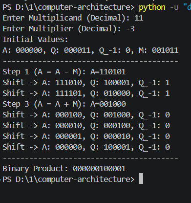

# Lab: Booth's Multiplication Algorithm

---

## Objective

- To understand the Booth multiplication algorithm for signed binary numbers.
- To implement the Booth algorithm and verify it with test cases.

---

## Theory

The Booth Algorithm (1951) is an efficient method for multiplying two signed integers in two's complement representation. It reduces the number of addition/subtraction operations by exploiting runs of consecutive 1s and 0s in the multiplier.

---

## Algorithm

Given multiplicand M and multiplier Q, both n bits:

1. **Initialize:** Accumulator A = 0, Q₋₁ = 0, step count = n.
2. **Examine** the last bit of Q (Q₀) and Q₋₁:

| Q₀ | Q₋₁ | Operation   |
|----|-----|-------------|
| 0  | 0   | No operation (shift only) |
| 0  | 1   | A = A + M   |
| 1  | 0   | A = A − M   |
| 1  | 1   | No operation (shift only) |

3. **Arithmetic right shift** the combined register [A, Q, Q₋₁] by 1 bit.
4. **Repeat** steps 2–3 for n cycles.
5. **Result** is in [A, Q].

---

## Program

```python
def add(x, y):
    max_len = max(len(x), len(y))
    x = x.zfill(max_len)
    y = y.zfill(max_len)
    result = []
    carry = 0
    for i in range(max_len - 1, -1, -1):
        r = carry
        r += 1 if x[i] == '1' else 0
        r += 1 if y[i] == '1' else 0
        result.append('1' if r % 2 == 1 else '0')
        carry = 1 if r >= 2 else 0
    if carry:
        result.append('1')
    return ''.join(reversed(result))


def complement(val):
    ones = ''.join('1' if b == '0' else '0' for b in val)
    return add(ones, '1')


def arithmetic_right_shift(A, Q, Q_1):
    combined = A + Q + Q_1
    shifted = combined[0] + combined[:-1]
    new_A = shifted[:len(A)]
    new_Q = shifted[len(A):len(A) + len(Q)]
    new_Q_1 = shifted[-1]
    return new_A, new_Q, new_Q_1


def booth_multiplication(multiplicand, multiplier):
    bit_len = max(multiplicand.bit_length(), multiplier.bit_length()) + 2
    if multiplicand < 0:
        M = complement(format((1 << bit_len) + multiplicand, f'0{bit_len}b'))[-bit_len:]
    else:
        M = format(multiplicand, f'0{bit_len}b')
    if multiplier < 0:
        Q = complement(format((1 << bit_len) + multiplier, f'0{bit_len}b'))[-bit_len:]
    else:
        Q = format(multiplier, f'0{bit_len}b')
    A = '0' * bit_len
    Q_1 = '0'
    M_neg = complement(M)[-bit_len:]
    print(f"Initial Values:")
    print(f"A: {A}, Q: {Q}, Q_-1: {Q_1}, M: {M}")
    print("-" * 40)
    for i in range(1, bit_len + 1):
        last_two = Q[-1] + Q_1
        if last_two == "10":
            A = add(A, M_neg)[-bit_len:]
            print(f"Step {i} (A = A - M): A={A}")
        elif last_two == "01":
            A = add(A, M)[-bit_len:]
            print(f"Step {i} (A = A + M): A={A}")
        A, Q, Q_1 = arithmetic_right_shift(A, Q, Q_1)
        print(f"Shift -> A: {A}, Q: {Q}, Q_-1: {Q_1}")
    product_binary = A + Q
    return product_binary


if __name__ == "__main__":
    try:
        num1 = int(input("Enter Multiplicand (Decimal): "))
        num2 = int(input("Enter Multiplier (Decimal): "))
        result_bin = booth_multiplication(num1, num2)
        print("-" * 40)
        print(f"Binary Product: {result_bin}")
    except ValueError:
        print("Please enter valid integers.")
```

---

## Output

**Test Case: Multiplicand = 11, Multiplier = −3**

```
Enter Multiplicand (Decimal): 11
Enter Multiplier (Decimal): -3
Initial Values:
A: 000000, Q: 000011, Q_-1: 0, M: 001011
----------------------------------------
Step 1 (A = A - M): A=110101
Shift -> A: 111010, Q: 100001, Q_-1: 1
Shift -> A: 111101, Q: 010000, Q_-1: 1
Step 3 (A = A + M): A=001000
Shift -> A: 000100, Q: 001000, Q_-1: 0
Shift -> A: 000010, Q: 000100, Q_-1: 0
Shift -> A: 000001, Q: 000010, Q_-1: 0
Shift -> A: 000000, Q: 100001, Q_-1: 0
----------------------------------------
Binary Product: 000000100001
```

**Verification:** 11 × (−3) = **−33**
Binary `000000100001` = 33 in magnitude → −33 in two's complement ✓



---

## Conclusion

The Booth multiplication algorithm was successfully implemented in Python and verified for signed binary multiplication. The test case of 11 × (−3) produced the correct binary result `000000100001` (−33), confirming that the algorithm accurately handles mixed-sign operands using two's complement arithmetic with arithmetic right shifts.
